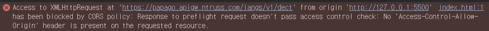

# papago 클론 코딩 (ajax 사용)

## 구현 사항
- JavaScript와 Papago API를 활용하여 언어 감지 , 텍스트 번역 기능을 구현

## 활용 기술 스택
- Vanilla JS

## 확인 사항
[ ] Vanilla JS 사용  
[ ] 모듈화 지향  
[ ] 비동기 처리  
[ ] 에러 처리  
[ ] 하드코딩 금지  
[ ] API 키 노출 방지  
[ ] 주석 작성  

## 어려웠던 점
- app.js에서 XMLHttpRequest를 활용해서 naver API로 요청을 전송 

-> CORS 에러 발생 (Same Origin Policy으로 인해) 
-> Naver에서 Access Control Allow Origin Header에 허용을 안해놓은거 같다. / 브라우저에서 차단 
-> 해결 방법  
    - 서버와 서버의 통신으로 진행하여 CORS 발생을 방지한다. 
    - JS로 서버를 실행시키는 코드를 작성, Node.js(브라우저에 존재하던 JS 런타임 코드를 밖으로 따로 복사한 것)로 실행 
 
-디바운싱 
->textarea를 queryselector로 가져온 뒤, input이라는 이벤트가 발생할 때마다 실행되는 eventlistener를 추가해준다. 이 리스너는 settimeout을 설정해준다.  
->그 뒤, timer라는 변수에 setimeout이 반환하는 timer id를 저장 시킨 뒤, 1.5초 경과 후 번역을 진행한다.  
->만약 1.5초 이내로 타이핑이 진행된다면 그 전에 존재하던 timer를 cleartimeout을 통해 삭제하여 api 중복 호출을 방지한다.

📌 쓰로틀링(주로 스크롤 이벤트) vs 디바운싱(주로 타이핑 이벤트)

-서버 상에서 받아온 데이터가 undefined로 보이는 문제 
->json 직렬화를 한 뒤 json 역직렬화를 할 수 있는 미들웨어 추가

## 중심 코드
app.js, serverV3.js